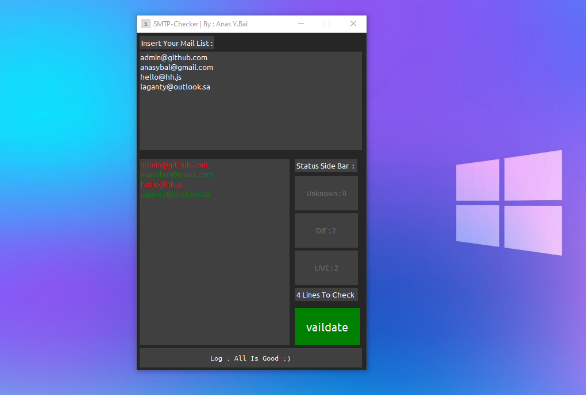
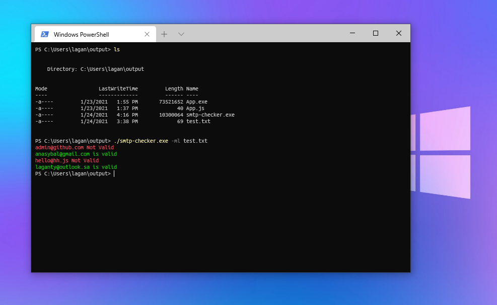

<p align="center">

</p>

# smtp-checker
smtp checker tool 
this tool can work as will (Cli/Gui)

For (Windows/Linux)

`no` more info it's clean code :]
# work
@CLI:
```bash
main.py -m anasybal@gmail.com
anasybal@gmail.com is valid
```
or
```bash
main.py -ml ./list.txt
anasybal@gmail.com is valid
anasybal222@gmail.com is not valid
admin@ssss.com is not valid
```

@GUI:
```bash
main.py
```
just that :)


# API
```python
import requests

def check(mail):
    url = "https://validateemailaddress.org/"
    payload="email="+mail.replace("@","%40")
    headers = {
        'User-Agent': 'Mozilla/5.0 ',
        'Accept': 'text/html,application/xhtml+xml,application/xml;q=0.9,image/webp,*/*;q=0.8',
        'Accept-Language': 'en-US,en;q=0.5',
        'Accept-Encoding': 'gzip, deflate, br',
        'Content-Type': 'application/x-www-form-urlencoded',
        'Content-Length': '26',
        'Origin': 'https://validateemailaddress.org',
        'DNT': '1',
        'Connection': 'keep-alive',
        'Referer': 'https://validateemailaddress.org/',
        'Upgrade-Insecure-Requests': '1',
        'Sec-GPC': '1'
    }
    response = requests.post(url, headers=headers, data=payload)
    return response.text
```

# screens



